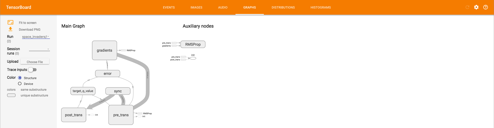
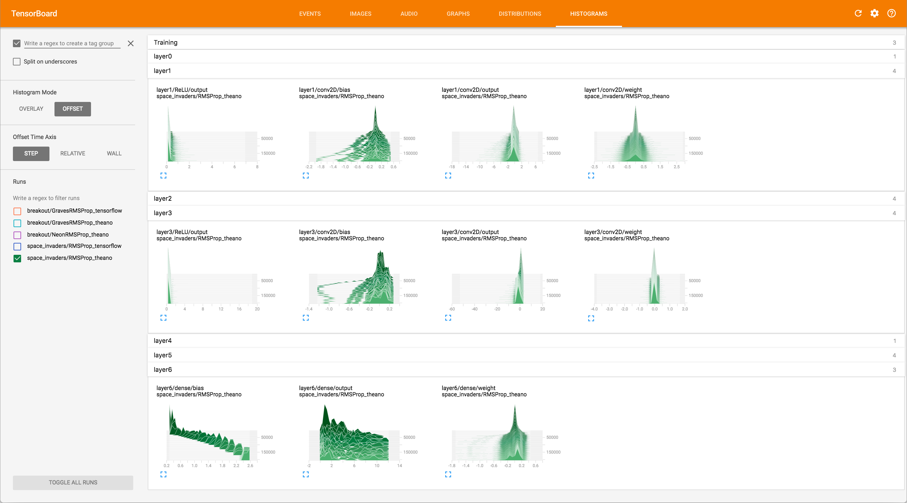

## Overview

Luchador is a library for Reinforcement Learning with forcus on Deep Reinforcement Learning. It contains environment, agent and runner implementation.

In Reinforcement Learning, we need to set a lot of parameters for environment behavior, agent behavior, learning behavior, experiment setting and so on. In case of Deep Reinforcement Learning, we also need to define network architecture and hyper parameters for optimization. When conducting research on RL, it is helpful to be able to run experiments with just simple modifications in configuration file so that not only a new experiment can be started quickly but also keeping the results organized with configuration file.

Luchador's design principle is easy configuration and customization. If the library does not meet your requirement, you can add the missing component and you only need to update the necessary configuration part to use it. For example, you can reuse an agent implementation while adding new neural network module, or you can add new agent while using an existing network architecture. Let's see this by following examples. 

### 1. Running Predefined Agent and Env
For the installation instruction, please refere to [Installation](## Installation). Once you installed Luchador, you have command called `luchador`. `luchador` is a simple script which invokes single agent episode runner, similar to the following snipet.

```python
from luchador.env import get_env
from luchador.agent import get_agent
from luchador.episode_runner import EpisodeRunner

def main(env, agent, episodes, steps):
    # Create environment
	Environment = get_env(env['name'])
	env = Environment(**env['args'])

    # Create agent
    Agent = get_agent(agent['name'])
    agent = Agent(**agent['args'])
    agent.init(env)

    # Run episodes
    runner = EpisodeRunner(env, agent, max_steps=steps)
    for i in range(episodes):
        runner.run_episode()
```

`luchador` command takes configuration files for environment and agent as it's argument. (Run `luchador --help` to see options, and for the detail of the command, see `luchador/exercise.py`).

Examples of configuration files are found in `example` directory. Let's train [DeepMind's DQN Agent on Atari environment](https://storage.googleapis.com/deepmind-media/dqn/DQNNaturePaper.pdf), using them. Run the following command from the top directory of luchador.

```bash
luchador --env example/ALEEnvironment_train.yml --agent example/DQNAgent_train.yml --episodes 100000  --steps 10000
```

This will let agent play 100000 games (episodes), each of which can have 10000 steps at most. Looking inside of these YAML files, you can tell that agent is playing Space Invaders, that the agent has network architecture defined in `example/vanilla_dqn.yml` which is 3 layers of convolution followed by 2 layers of inner product layers, and such.

After the training is done, the trained parameter is saved at `results` directory. It takes about a day on GPU to finish this, so I included the result in `example/space_invaders_vanilla_dqn_99000.h5`, and you can run it by the following command in test mode.

```bash
luchador --env example/ALEEnvironment_test.yml --agent example/DQNAgent_test.yml
```

You should be able to see the agent plays Space Invaders effectively.


You can use Tensorboard to visualize the training.

```bash
tensorboard --logdir results
```






You can modify the files to run experiments in different configuration. For example, you can change the game to run by editing `example/ALEEnvironment_train.yml`, network architecture by editing `example/vanilla_dqn.yml`, or Q Learning parameter by editing `example/DQNAgent_train.yml`.

### 2. Running a custom Agent

`luchador` has a traversal mechanism to find subclass, so you do not need to modify and re-install the library to add custom agent, environment, NN layor or NN model architecture. By subclassing the corresponding base class and loading the souce you can use it in the same manner as using the pre-defined ones. Let's create a new agent.

To create Agent, you must subclass `luchador.agent.BaseAgent` class and implement `__init__`, `reset`, `observe` and `act` method. You have the following minimal implementation in `example/custom_agent.py`. Agent will just behave randomly.

```python
from luchador.agent import BaseAgent

import numpy as np


class MyRandomAgent(BaseAgent):
    def __init__(self):
        pass

    def init(self, env):
        self.n_actions = env.n_actions

    def reset(self, observation):
        pass

    def observe(self, action, outcome):
        pass

    def act(self):
        return np.random.randint(self.n_actions)
```

Then, check that `luchador.agent.get_agent` function can find this calss by name.

```bash
$ python
>>> import example.custom_agent
>>> from luchador.agent import get_agent
>>> get_agent('MyRandomAgent')
<class 'example.custom_agent.MyRandomAgent'>
```

To use this new agent, we need to create configuration file. As this agent does not take any constructor argument, configuration file is as simple as follow.

```yaml
name: MyRandomAgent
args: {}
```

You can use the same `luchador` command to run this agent, by giving the location of the file (in Python's dot notation) as `--sources` argument.

```bash
luchador --env example/ALEEnvironment_test.yml --agent example/MyRandomAgent.yml --sources example.custom_agent
```

### 3. Adding a new environment

Adding new Environment is very similar to Agent. Subclass from `luchador.env.BaseEnvironment` and then implement `__init__`, `reset` and `step` methods and `n_actions` property.

### 4. Adding neural network components

Adding neural network component is a little bit complicated than other component, as there are different level of configurations (Layer and Model which is a set of Layers). For simplicity, here we forcus on Theano backend. (To make luchador use Theano backend, you may need to set environmental variable `LUCHADOR_NN_BACKEND` to `theano`)

#### 1. Layer
To add new layer, you need to subclass from `luchador.nn.BaseLayer`, then implement `build` method. `build` is called with the input Variable. Let's add [Parametric ReLU](https://en.wikipedia.org/wiki/Rectifier_%28neural_networks%29) Layer as an example.

```python
from luchador.nn import BaseLayer

class PReLU(BaseLayer):
	def __init__(self, alpha):
	    super(PReLU, self).__init__(alpha=alpha)

    def build(self, input_tensor):
		alpha = self.args['alpha']
        x = input_tensor.get()  # Unwrap the variable
		output_tensor = T.switch(x < 0, alpha * x, x)
		return Tensor(output_tensor, shape=input_tensor.shape)
```

Then you can retrieve this with `luchador.nn.get_layer` function.

```bash
$ python
>>> import example.custom_layer
2016-09-27 15:36:53,129:  INFO: Using theano backend
>>> from luchador.nn import get_layer
>>> get_layer('PReLU')
<class 'example.custom_layer.PReLU'>
```

#### 2. Model

Network architecture can be described using a set of layer configurations, and we use YAML for easy reading and writing.

```yaml
model_type: Sequential
layer_configs:
  - scope: layer1
    layer:
      name: Conv2D
      args:
        n_filters: 32
        filter_width: 8
        filter_height: 8
        strides: 4
        padding: valid
  - scope: layer2
    layer:
      name: ReLU
      args: {}
  - scope: layer3
    layer:
      name: Dense
      args:
        n_nodes: 3
```

You can feed this configuration to `luchador.nn.util.make_model` then the function will return the coresponding network architecture.

But having static parameters is sometimes inconvenient. For example, although the 5 layers of DQN are fixed, the output size (which corresponds to `n_nodes` in above) can vary from the environment to run. To accomodate this needs, we have `luchador.nn.util.get_model_config` which will substitute parameters at load-time using Python's format notation. Let's modify the above configuration file to parameterize `n_nodes` and call this file `model.yml`

```yaml
model_type: Sequential
layer_configs:
  - scope: layer1
    layer:
      name: Conv2D
      args:
        n_filters: 32
        filter_width: 8
        filter_height: 8
        strides: 4
        padding: valid
  - scope: layer2
    layer:
      name: ReLU
      args: {{}}
  - scope: layer3
    layer:
      name: Dense
      args:
        n_nodes: {n_actions}
```

When you load this file with `luchador.nn.util.make_model('model.yml', n_actions=5)`, 5 is substituted at `{n_actions}`. Notice that `ReLU`'s `args` parameter became `{{}}` from `{}` so that it Python's `format` function will replace it to `{}`.

#### 3. Other NN components

NN module has other components such as Optimizer, Cost functions and Q-learning. Adding new classes for those types are pretty much similar to Layer or Agent.

## Installation

### Note on backend
Luchador has `luchador.nn.summary.SummaryWriter` class which wraps Tensorflow's SummaryWriter class so that not only `Tensorflow` backend but also `Thenao` backend can produce summary data which can be visualized with `tensorboard`. However, when using `Theano` backend and if Tensorflow is installed with GPU enabled, Tensorflow detects that other library is using GPU and fail the program. Therefore it is strongly advised to setup a new python environment when you use Theano and Tensorflow (SummaryWriter) at the same time.

### Dependencies

- Luchador uses Thensorflow or Theano as neural network backend, so you need to install them. Refer to the installation instruction for each project.
- [ALE](https://github.com/mgbellemare/Arcade-Learning-Environment) is required to run Atari environments.

The following dependencies are automatically installed during the installation.

- `h5py` for saving neural network parameters
- `pyyaml` for parsing YAML files.
- `pygame` for FlappyBird environment.

### Installation

1. Download the source code `git clone https://github.com/mthrok/luchador && cd luchador`
2. Download ALE ROM files `python setup.py download_ale`
3. Install `pip install .`

### Update
`pip install --upgrade --no-deps git+git://github.com/mthrokr/luchador.git`

### Setting backend

At the time of importing `luchador.nn` module, luchador checks environmental variable `LUCHADOR_NN_BACKEND` to detcide which backend it should use. Set value either `tensorflow` or `theano` to switch backend. Or programtically, you can set backend before importing,

```python
import luchador
luchador.set_nn_backend('tensorflow')

import luchador.nn
```

Additionally you can configure default `dtype` and convolution format used in Tensorflow backend with `LUCHADOR_NN_DTYPE` and `LUCHADOR_NN_CONV_FORMAT`. These values are only used in Tensorflow backend.

To configure Theano, make `.theanorc` file in hme directory and follow the instruction found at Theano documentation..

## Development Plan

See [project list](https://github.com/mthrok/luchador/projects) for the list of plans.


## Bug report

Although automated integration test and unit test is set up via CircleCI, currently only small usage pattern is tested. If you find a bug, please open [an issue](https://github.com/mthrok/luchador/issues).
