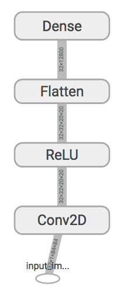

[](https://www.codacy.com/app/mthrok/luchador?utm_source=github.com&amp;utm_medium=referral&amp;utm_content=mthrok/luchador&amp;utm_campaign=Badge_Grade)
[](https://www.codacy.com/app/mthrok/luchador?utm_source=github.com&amp;utm_medium=referral&amp;utm_content=mthrok/luchador&amp;utm_campaign=Badge_Coverage)


## Overview

Luchador is a library for Deep Learning built on top of Tensorflow or Theano. You can build complex network using configuration file like Caffe, but with simpler YAML format.


### Build network from configuration file

In luchador, network components can be instantiated with python-primitive-type arguments (such as `number`, `string`, `list`, and `dict`), thus, just by giving the class name you want to instantiate (as `typename`) and its arguments (as `args`), the network can be built.

The following configuration file defines sequential network composed of convolution and non-linear activation followed by inner product.

```yaml
typename: Sequential
args:
  name: classifier
  input_config:
    typename: Input
    name: input_image
    shape: [32, 84, 84, 1]
  layer_configs:
    - typename: Conv2D
      args:
        n_filters: 32
        filter_width: 8
        filter_height: 8
        strides: 4
        padding: valid
    - typename: ReLU
    - typename: Flatten
    - typename: Dense
      args:
        n_nodes: 10
```

You can construct the model with `luchador.nn.make_model` function as following.

```python
import numpy as np
import luchador
import luchador.nn as nn

model_config = nn.get_model_config('model.yml')
model = nn.make_model(model_config)
```

This will create the following network. (To visualize network, you need to run luchador with Tensorflow backend. See [Setting Backend](#setting-backend) for this.)



For executing computation, luchador provides `Session` interface which works in a similar way as Tensorflow sesison.

```python
session = nn.Session()
session.initialize()

input_shape = [32, 84, 84, 1]
input_data = np.random.rand(*input_shape)
output_data = session.run(
    inputs={
        model.input: input_data,
    },
    outputs=model.output,
)
```


### Parameterize network structure

But fixing parameters is often inconvenient. You can put placeholder with `{placeholder_name}` in model YAML file and give value at runtime, by giving value to `get_model_config`.

In the following example, network input shape (`input_shape`) is set at runtime. At runtime, the code checks the current backend to define image channel order accordingly. (`NHWC` for Thensorflow CPU, `NCHW` for the others.)

```yaml
typename: Sequential
args:
  name: classifier
  input_config:
    typename: Input
    args:
      name: input_image
      shape: {input_shape}
  layer_configs:
    - typename: Conv2D
      args:
        n_filters: 32
        filter_width: 8
        filter_height: 8
        strides: 4
        padding: valid
    - typename: ReLU
    - typename: Flatten
    - typename: Dense
      args:
        n_nodes: 10
```

```python
be = luchador.get_nn_backend()
fmt = luchador.get_nn_conv_format()
if be == 'tensorflow' and fmt == 'NHWC':
    input_shape = [32, 84, 84, 1]
else:
    input_shape = [32, 1, 84, 84]

model_config = nn.get_model_config('model.yml', input_shape=input_shape)
model = nn.make_model(model_config)
```


### Complex networks

In the sense of computation node, Sequential model represents one-to-one mapping. To build more complex graph, one needs to create many-to-many mappings. In luchador you can use `Graph` and `Container` models and feed compound input object to build such network.


#### Commpound input

Luchador has `Input` class which represents single network input object. Under the hood, it wrapps Tensorflow's `placeholder` or Theano's equivalent (`TensorVariable`) class. When constructing complex network, one needs multiple of such objects. For example, `Optimizer`s require variables representing predicted values and correct values as its input. When defining network input `input_config` you can use either, single Input definition, list of definitions, or dictionary of definitions.

The following example defines the dictionary of Inputs, with keys `data` and `label`.

```yaml
input_config:
  data:
    typename: Input
    args:
      name: input_image
      shape: {image_shape}
  label:
    typename: Input
    args:
      name: label
      shape: {label_size}
      dtype: int64
```


The following defines the list version of the previous example.


```yaml
input_config:
  - typename: Input
    args:
      name: input_image
      shape: {image_shape}
  - typename: Input
    args:
      name: label
      shape: {label_size}
      dtype: int64
```


#### Retrieving existing component

Luchador uses retrieval mechanism similar to Tensorflow's `get_variable` but extends it to `Input` and `Tensor` (output) for flexible model construction. When constructing complex network, it is often required to retrieve Input, Output and Variable defined somewhere else. To retrieve existing instance, you can use the name of the instance.

```yaml
typename: Input
reuse: True
name: input_image
```

retrieves `Input` instance named `input_image`. `reuse` attribute is requried to `Input` type.


```yaml
typename: Tensor
name: dense/output
```

retrieves `Tensor` instance which is output from layer named `dense`.


```yaml
typename: Variable
name: conv/filter
```

retrieves `Variable` instance which is filter parameter of `Conv2D` layer named `conv`.


```yaml
typename: Model
name: foo
fetch: input
```

retrieves the `input` attribute of Model named `foo`.


```yaml
typename: Model
name: foo
fetch: output
```

retrieves the `output` attribute of Model named `foo`.


```yaml
typename: Model
name: foo
fetch: parameter
```

retrieves the list of trainable parameters of Model named `foo`.


#### Graph Model

In Sequential model, the input to the model is passed through each layers, thus you do not need to specify the input to each layer. In contrast, in Graph model, each node (corresponds to layer in Sequential) has its own input. In the following example, Adam optimizer is constructed and the output from the Model named `error` is fed as `loss` and the parameters of Model named `classifier` is fed as `wrt`.

```yaml
typename: Graph
args:
  name: optimization
  node_configs:
    - typename: Adam
      args:
        name: Adam
        learning_rate: 0.01
      input:
        loss:
          typename: Model
          name: error
          fetch: output
        wrt:
          typename: Model
          name: classifier
          fetch: parameter
```


#### Container Model

Container model combines multiple models in dictionary manner. In the following example, a Container model which contains three models (`classifier`, `error` and `optimization`) is defined. (The contents of each model is omitted here, using YAML's alias feature.)

```yaml
typename: Container
args:
  model_configs:
    - << : *classifier
      name: classifier
    - << : *error
      name: error
    - << : *optimization
      name: optimization
```


To define input/output of Graph and Container model, one needs to add `input_config` manually.


### Define new network component

You can add network component by subclassing the base class. For simplicity, here we forcus on Theano backend.

#### 1. Layer
To add new layer, you need to subclass from `luchador.nn.BaseLayer`, then implement `build` method. `build` is called with the input Variable. Let's add [Parametric ReLU](https://en.wikipedia.org/wiki/Rectifier_%28neural_networks%29) Layer as an example.

```python
from luchador.nn import BaseLayer


class PReLU(BaseLayer):
	def __init__(self, alpha):
	    super(PReLU, self).__init__(alpha=alpha)

    def build(self, input_tensor):
		alpha = self.args['alpha']
        x = input_tensor.get()  # Unwrap the variable
		output_tensor = T.switch(x < 0, alpha * x, x)
		return Tensor(output_tensor, shape=input_tensor.shape)
```

Then you can retrieve this with `luchador.nn.get_layer` function.

```bash
$ python
>>> import example.custom_layer
2016-09-27 15:36:53,129:  INFO: Using theano backend
>>> from luchador.nn import get_layer
>>> get_layer('PReLU')
<class 'example.custom_layer.PReLU'>
```

## Example

You can run simple AutoEncoder and MNIST classification examples as follow. Use `--help` for how to run.

```bash
python example/autoencoder/run_autoencoder.py
python example/classification/classify_mnist.py
```


## Installation

### Note on GPU backend
Luchador has `luchador.nn.summary.SummaryWriter` class which wraps Tensorflow's SummaryWriter class so that not only `Tensorflow` backend but also `Thenao` backend can produce summary data which then can be visualized with `tensorboard`. However, when using `Theano` backend and if Tensorflow is installed with GPU enabled, Tensorflow detects that other library is using GPU and fail the program. Therefore it is strongly advised to setup a new python environment when you use Theano and Tensorflow (SummaryWriter) at the same time.


### Dependencies

- Luchador uses Thensorflow or Theano as neural network backend, so you need to install them. Refer to the installation instruction for each project.

The following dependencies are automatically installed during the installation.

- `h5py` for saving neural network parameters
- `ruamel.yaml` for parsing YAML files.


### Installation

1. Download the source code `git clone https://github.com/mthrok/luchador && cd luchador`
3. Install `pip install .`


### Update
`pip install --upgrade --no-deps git+git://github.com/mthrok/luchador.git`


### Setting backend

At the time of importing `luchador.nn` module, luchador checks environmental variable `LUCHADOR_NN_BACKEND` to detcide which backend it should use. Set value either `tensorflow` or `theano` to switch backend.

```bash
LUCHADOR_NN_BACKEND=theano luchador
```

When running Tensorflow backend, you can additionally configure default `dtype` and convolution data format  with `LUCHADOR_NN_DTYPE` and `LUCHADOR_NN_CONV_FORMAT`. These values are only effective in Tensorflow backend. To configure Theano, make `.theanorc` file in home directory and follow the instruction found at Theano documentation..

```bash
LUCHADOR_NN_BACKEND=tensorflow LUCHADOR_NN_CONV_FORMAT=NHWC LUCHADOR_NN_DTYPE=float32 luchador 
```

Or programtically, you can set backend before importing `nn` module.

```python
import luchador
luchador.set_nn_backend('tensorflow')
luchador.set_nn_conv_format('NHWC')
luchador.set_nn_dtype('float32')

import luchador.nn  # tensorflow backend is loaded
```


## Development Plan

See [project list](https://github.com/mthrok/luchador/projects) for the list of plans.


## Bug report

Although automated integration test and unit test is set up via CircleCI, currently only small usage pattern is tested. If you find a bug, please open [an issue](https://github.com/mthrok/luchador/issues).
